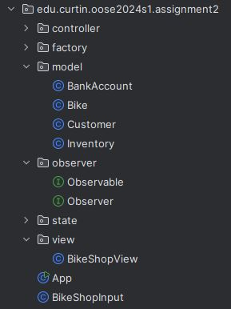

# Responses To The Criteria

## (e) Observer Pattern
### Observer Pattern
- `observer` package with `Observable` and `Observer` classes.
- `BikeShopView` is the observer.
- `BankAccount` and `Inventory` are the observables.

The model classes, such as BankAccount and Inventory, hold the core state of the application that needs to be observed by the view to reflect the current status of the bike shop. The controller will interact with these model classes to update the state based on business logic, and these changes will be communicated to the view through the observer pattern.

### Explanation of the Observer Pattern Implementation
1. Observable (BankAccount and Inventory):
    - Both `BankAccount` and `Inventory` classes implement the `Observable` interface.
    - They maintain a list of observers and notify them whenever their state changes (e.g., when the balance is updated or when a bike is added/removed).

2. Observer (BikeShopView):
    - `BikeShopView` implements the `Observer` interface.
    - It registers itself as an observer to both `BankAccount` and `Inventory`.
    - The `update` method in `BikeShopView` is called whenever `BankAccount` or `Inventory` notify their observers of a change. This ensures that the view always displays the current state of the model.



#### Observer Pattern Implementation
```java
/** Interface for observable objects. */
public interface Observable
{
    // Adds an observer to the list of observers.
    void addObserver(Observer observer);
    
    // Removes an observer from the list of observers.
    void removeObserver(Observer observer);
    
    // Notifies all observers of changes.
    void notifyObservers();
}

/** Manages the shop's bank account. */
public class BankAccount implements Observable
{
    private final List<Observer> observers = new ArrayList<>();

    // Adds the specified amount to the balance and notifies observers of the change.
    public void deposit(int amount)
    {
        balance += amount;
        notifyObservers();
    }
    
    // Subtracts the specified amount from the balance. Notifies observers if withdrawal is successful.
    public void withdraw(int amount, boolean isEmployeePayment)
    {
        if (isEmployeePayment || balance >= amount)
        {
            balance -= amount;
            notifyObservers();
        }
        ...
    }
    
    // Adds an observer to the list of observers.
    @Override
    public void addObserver(Observer observer)

    {
        observers.add(observer);
    }
    
    // Removes an observer from the list of observers.
    @Override
    public void removeObserver(Observer observer)
    {
        observers.remove(observer);
    }
    
    // Notifies all registered observers of changes by calling their update method.
    @Override
    public void notifyObservers()
    {
        for (Observer observer : observers)
        {
            observer.update();
        }
    }
}

/** Manages the bike inventory. */
public class Inventory implements Observable
{
    private final List<Observer> observers = new ArrayList<>();

    // Adds a bike to the available bikes list. Notifies observers.
    public void addAvailableBike(Bike bike)
    {
        availableBikes.add(bike);
        notifyObservers();
    }

    // Removes a bike from the available bikes list. Notifies observers.
    public void removeAvailableBike(Bike bike)
    {
        availableBikes.remove(bike);
        notifyObservers();
    }

    // Adds a bike to the serviced bikes list. Notifies observers.
    public void addServicedBike(Bike bike)
    {
        servicedBikes.add(bike);
        notifyObservers();
    }

    // Adds a bike to the awaiting pickup bikes list. Notifies observers.
    public void addAwaitingPickupBike(Bike bike)
    {
        awaitingPickupBikes.add(bike);
        notifyObservers();
    }

    // Removes a bike from the awaiting pickup bikes list. Notifies observers.
    public void removeAwaitingPickupBike(Bike bike)
    {
        awaitingPickupBikes.remove(bike);
        notifyObservers();
    }

    // Increments the days in servicing state for all serviced bikes.
    public void incrementDaysInServicingState()
    {
        Iterator<Bike> iterator = servicedBikes.iterator();
        while (iterator.hasNext())
        {
            Bike bike = iterator.next();
            bike.incrementDaysInServicingState();
            if (bike.getState() instanceof AwaitingPickupState)
            {
                iterator.remove();
                addAwaitingPickupBike(bike);
            }
        }
        notifyObservers();
    }

    // Adds an observer to the list of observers.
    @Override
    public void addObserver(Observer observer)
    {
        observers.add(observer);
    }

    // Removes an observer from the list of observers.
    @Override
    public void removeObserver(Observer observer)
    {
        observers.remove(observer);
    }

    // Notifies all observers of changes to the inventory.
    @Override
    public void notifyObservers()
    {
        for (Observer observer : observers)
        {
            observer.update();
        }
    }
}

/** Interface for observers. */
public interface Observer {
    // Called by the observable to notify the observer of changes.
    void update();
}

/** Displays shop statistics and messages.*/
public class BikeShopView implements Observer
{
    // Registers the BikeShopView as an observer for the BankAccount and Inventory.
    public void registerObservers(BankAccount bankAccount, Inventory inventory)
    {
        bankAccount.addObserver(this);
        inventory.addObserver(this);
    }
    
     // Updates the view. This method is called when the observable notifies its observers.
    @Override
    public void update() {}
    
    // Unregisters the BikeShopView as an observer for the BankAccount and Inventory.
    public void unregisterObservers(BankAccount bankAccount, Inventory inventory)
    {
        bankAccount.removeObserver(this);
        inventory.removeObserver(this);
    }
}
```

## (f) State Pattern
### State Pattern
- **Design Purpose**: Allows the `Bike` class to change its behavior when its state changes, enabling dynamic state transitions.
- **Implemented in**: `Bike` class.
    - Defined by `BikeState` interface.
    - Implemented by `AvailableState`, `ServicingState`, `AwaitingPickupState`.

#### State Pattern Implementation
```java
/** Interface for bike states. */
public interface BikeState {
    void dropOff(Bike bike); // Defines the behavior for dropping off a bike in a specific state.
    void pickUp(Bike bike); // Defines the behavior for picking up a bike in a specific state.
    void purchase(Bike bike); // Defines the behavior for purchasing a bike in a specific state.
}

/** Represents a bike */
public class Bike {
    private BikeState state;

    private BikeState state;
    private String associatedEmail;
    private int daysInServicingState;

    // Constructor initialises the bike with the available state.
    public Bike()
    {
        this.state = new AvailableState();
        this.daysInServicingState = 0;
    }

    // Returns the current state of the bike.
    public BikeState getState()
    {
        return state;
    }

    // Sets the state of the bike to the given state.
    public void setState(BikeState state)
    {
        this.state = state;
    }

    // Sets the email associated with the bike to the given email.
    public void setAssociatedEmail(String email)
    {
        this.associatedEmail = email;
    }

    // Delegates the drop-off action to the current state.
    public void dropOff()
    {
        state.dropOff(this);
        daysInServicingState = 0; // Reset days in servicing state
    }

    // Delegates the pick-up action to the current state.
    public void pickUp()
    {
        state.pickUp(this);
        logger.info(() -> "Bike picked up. State: " + state);
    }

    // Delegates the purchase action to the current state.
    public void purchase()
    {
        state.purchase(this);
    }

    // Increments the days the bike has been in the servicing state.
    public void incrementDaysInServicingState()
    {
        if (state instanceof ServicingState)
        {
            daysInServicingState++;
            if (daysInServicingState > 2)
            {
                // Transition to AwaitingPickupState after servicing
                state = new AwaitingPickupState();
            }
        }
    }

    // Returns the number of days the bike has been in the servicing state.
    public int getDaysInServicingState()
    {
        return daysInServicingState;
    }

    // Returns a string representation of the bike, including its state and associated email.
    @Override
    public String toString()
    {
        return "Bike{" +
                "state=" + state +
                ", associatedEmail='" + associatedEmail + '\'' +
                ", daysInServicingState=" + daysInServicingState +
                '}';
    }
}

/* Concrete state for bikes that are available. */
public class AvailableState implements BikeState
{
    // Transitions the bike to the servicing state and disassociates any email.
    @Override
    public void dropOff(Bike bike)
    {
        bike.setState(new ServicingState());
        bike.setAssociatedEmail(null);
    }

    // Throws an IllegalStateException because picking up a bike is not valid in the available state.
    @Override
    public void pickUp(Bike bike)
    {
        throw new IllegalStateException("Bike cannot be picked up when it is available.");
    }

    // Transitions the bike to the awaiting pickup state.
    @Override
    public void purchase(Bike bike)
    {
        bike.setState(new AwaitingPickupState());
    }

    // Returns the string representation of the state.
    @Override
    public String toString()
    {
        return "Available";
    }
}

/** Concrete state for bikes that are being serviced. */
public class ServicingState implements BikeState
{
    // Throws an exception as dropping off a bike is not a valid operation when the bike is already being serviced.
    @Override
    public void dropOff(Bike bike)
    {
        throw new IllegalStateException("Bike is already being serviced.");
    }

    // Transitions the bike to the Available state and clears the associated email.
    @Override
    public void pickUp(Bike bike)
    {
        bike.setState(new AwaitingPickupState());
    }

    // Throws an exception as purchasing a bike is not a valid operation when the bike is being serviced.
    @Override
    public void purchase(Bike bike)
    {
        throw new IllegalStateException("Bike cannot be purchased when it is being serviced.");
    }

    // Returns the string representation of the state.
    @Override
    public String toString()
    {
        return "Being Serviced";
    }
}

/** Concrete state for bikes that are awaiting pickup. */
public class AwaitingPickupState implements BikeState
{
    // Throws an IllegalStateException because dropping off a bike is not valid in the awaiting pickup state.
    @Override
    public void dropOff(Bike bike)
    {
        throw new IllegalStateException("Bike cannot be dropped off when it is awaiting pickup.");
    }

    // Transitions the bike to the available state and disassociates any email.
    @Override
    public void pickUp(Bike bike)
    {
        bike.setState(new AvailableState());
    }

    // Throws an IllegalStateException because purchasing a bike is not valid in the awaiting pickup state.
    @Override
    public void purchase(Bike bike)
    {
        throw new IllegalStateException("Bike is already purchased.");
    }

    // Returns the string representation of the state.
    @Override
    public String toString()
    {
        return "Awaiting Pickup";
    }
}
```

## (a) General Code Quality
- **Comments and Documentation**: Comprehensive comments included throughout.

For example:
```java
package edu.curtin.oose2024s1.assignment2.view;

import edu.curtin.oose2024s1.assignment2.model.*;
import edu.curtin.oose2024s1.assignment2.observer.Observer;

import java.io.FileWriter;
import java.io.IOException;
import java.io.PrintWriter;
import java.util.logging.Logger;

/**
 Purpose:
 - This class will manage the display of the bike shop's status, such as the number of bikes available, being serviced, and awaiting pickup, as well as the bank account balance. It will also handle logging messages to the console and writing them to the "sim_results.txt" file.
 Role:
 - Acts as the presentation layer of the application, showing the current state of the bike shop to the user and ensuring that all output is logged appropriately.
 */
// Displays shop statistics and messages.
public class BikeShopView implements Observer
{
    private static final Logger logger = Logger.getLogger(BikeShopView.class.getName());
    private PrintWriter writer;

    /**
     METHOD: BikeShopView
     IMPORT: None
     EXPORT: None
     ALGORITHM:
     Constructor that initialises the PrintWriter for writing to the "sim_results.txt" file.
     */
    public BikeShopView()
    {
        try
        {
            writer = new PrintWriter(new FileWriter("sim_results.txt", true));
            logger.info("sim_results.txt opened successfully.");
        }
        catch(IOException e)
        {
            logger.severe(() -> "Error opening sim_results.txt: " + e.getMessage());
        }
    }
...
```
- **PMD Compliance**: No warnings.

## (b) Clear and Distinct Package/Class/Interface/Method Responsibilities
### Package Responsibilities
- **Purpose**: Organises the code into meaningful packages, enhancing modularity and maintainability.
- **Package Structure**:
    - `controller`: Manages operations and processes events.
    - `factory`: Creates new Bike instances.
    - `model`: Represents the core data and state of the application.
    - `observer`: Defines the observer pattern interfaces and classes.
    - `state`: Implements the state pattern for `Bike` states.
    - `view`: Manages the display of the bike shop's status.


## (c) Appropriate Error Handling and Logging
### Error Handling
- Applied the same logic and practices as Assignment 1.

### Logging
- Applied the same logic and practices as Assignment 1.

#### Example of Error Handling and Logging
```java
/**
 METHOD: run
 IMPORT: None
 EXPORT: None
 ALGORITHM:
 Executes the event loop, processing messages and updating the bike shop's state.
 */
public void run() throws IOException
{
    int daysElapsed = 0;
    logger.info("\n\nStarting event loop.");

    try
    {
        while(System.in.available() == 0)
        {
            // Clear the console for better UX
            System.out.print("\033[H\033[2J");
            System.out.flush();

            // Simulate one day
            daysElapsed++;
            int finalDaysElapsed = daysElapsed;
            logger.fine(() -> "\n\nSimulated day: " + finalDaysElapsed);

            // Display status
            bikeShopView.displayStatus(daysElapsed, bankAccount, inventory);

            // Pay the employee every 7 days
            if (daysElapsed % 7 == 0)
            {
                bankAccount.withdraw(1000, true); // $1000 payment to the employee
                int finalDaysElapsed1 = daysElapsed;
                logger.info(() -> "Employee paid $1000 on day " + finalDaysElapsed1 + ".");
            }

            // Process all messages for this day
            String message = bikeShopInput.nextMessage();
            while(message != null)
            {
                totalMessages++;
                String result = bikeShopController.processMessage(message);
                if(result.startsWith("FAILURE"))
                {
                    totalFailures++;
                }
                System.out.println(result);
                bikeShopView.logToFile(result);
                message = bikeShopInput.nextMessage();
            }

            // Increment the days in servicing state for all serviced bikes
            inventory.incrementDaysInServicingState();

            // Sleep for 1 second (simulates 1 day)
            try
            {
                Thread.sleep(1000);
            }
            catch(InterruptedException e)
            {
                logger.severe(() -> "Thread interrupted: " + e.getMessage());
                throw new AssertionError(e);
            }
        }
    }
    catch (IOException e)
    {
        logger.severe(() -> "I/O error during event loop: " + e.getMessage());
        throw e;
    }

    // Final statistics
    displayFinalStatistics(totalMessages, totalFailures);
    logger.info("Event loop ended.");

    // Unregister observers at the end of the simulation
    bikeShopView.unregisterObservers(bankAccount, inventory);
}
```

## (d) Implementation of a Factory and Dependency Injection
### Factory
- **Implemented in**: `BikeFactory` class.

#### Example of Factory Pattern Implementation
```java
// Creates new Bike instances.
public class BikeFactory
{
    private static final Logger logger = Logger.getLogger(BikeFactory.class.getName());

    /**
     METHOD: createBike
     IMPORT: None
     EXPORT: bike (Bike)
     ALGORITHM:
     Creates and returns a new Bike instance.
     */
    public Bike createBike()
    {
        Bike bike = new Bike();
        logger.info(() -> "Created new bike: " + bike);
        return new Bike();
    }
}
```

### Dependency Injection
- **Implemented in**: `BikeShopController` constructor.

#### Example of Dependency Injection
```java
    /**
     METHOD: BikeShopController
     IMPORT: inventory (Inventory), bankAccount (BankAccount)
     EXPORT: None
     ALGORITHM:
     Constructor that initialises the inventory and bank account.
     */
    public BikeShopController(Inventory inventory, BankAccount bankAccount)
    {
        this.inventory = inventory;
        this.bankAccount = bankAccount;
        this.bikeFactory = new BikeFactory();
    }
```

## (h) Meaningful Use of Generics
### Generics Usage
- **Note**: Generics were not implemented in this project.

## References
1. https://www.cs.unc.edu/~carterjl/teaching/notes/15_MVC_Notes.pdf - Used to help understand and implement observer pattern (only used for contextual based knowledge and further understanding of observer pattern).
